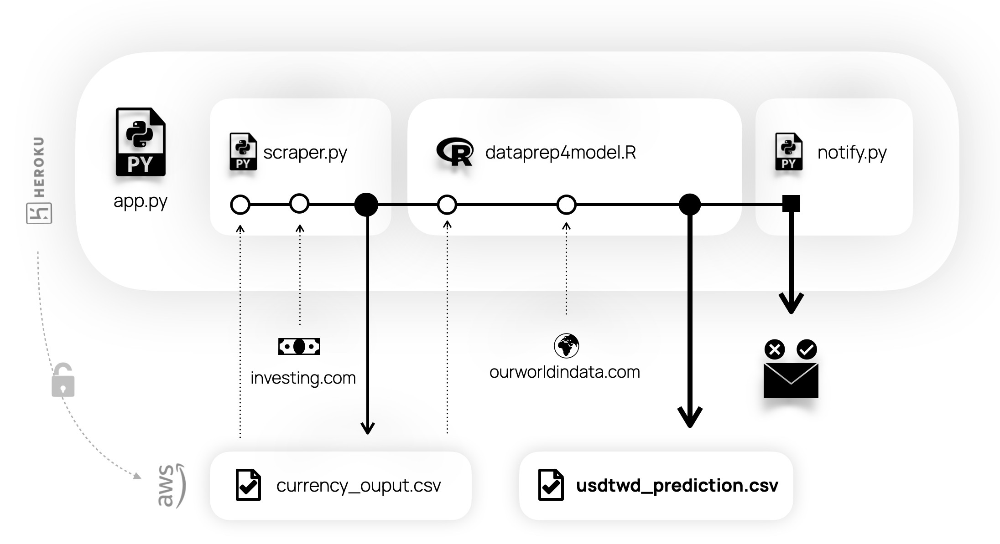

# Data pipeline

*Group 3: Spe C., Núria A., Xavier B.*

The code aims to make available daily results of an statistical prediction model that ingests currency exchanges scrapped from investing.com and the Covid-19 dataset from [ourworldindata.org](http://ourworldindata.org).



## Structure
The application runs in `python` the tasks for
 - Directing the pipeline (`app.py`) 
 - Scrap data from investing.com (`scraper.py`)
 - Handling the AWS S3 interface for storing data(`upload_to_s3.py`) 
 - The notificaton system (`notify.py`). 

Data processes are coded in `R`, this includes
 -  The predictive model (`dataprep4model.R`)
 -  Data preparation (`dataprep.R`).

The prediction model ingests COVID-19 data directly from ourworldindata.org, the output of the data preparation script is only used for the notification system.

The code is deployed on a free Heroku dyno properly set to run both `python` and `R`code.

## Steps 
1. Start the process and direct it till the end. (`app.py`)
2. Scrap currency data (`scraper.py`)
3. Upload currency data to to S3 (`currency_output.csv`)
4. Call the system to run the `.R` files
5. Capture the output of R files and upload to S3 
  - Updated model results (`usdtwd_prediction.csv`)
  - Recent covid values for report (`dailystats.csv`)
6. Check S3 links and summarize content for report (`check_uploaded_file.py`)
7. Each step appends its status in the `to_report` object and is gathered  which is  report(`notifypy`)
8. Set schedule to run daily

## Deployment
There's the file `runtime.txt`specifying Heroku which `python` version should use to ensure same compatibility as development environment. 

Python libraries are set in the file `requirements.txt`.

Heroku has default buildpacks for `python` but none to run `R` code. The set up uses a third-party buildpack for R in Heroku which is [available here.](https://github.com/virtualstaticvoid/heroku-buildpack-r) 

Using Heroku CLI to set the repository and push it. 
```
$ git:remote -a mvtec-pipeline
$ git add .
$ git commit -am "deploy"
$ git push heroku main
```
Installing R runtime with buildpacks.
```
$ heroku buildpacks:add https://github.com/virtualstaticvoid/heroku-buildpack-r.git
```
---- 
#### Installing R packages
[Docs](https://github.com/virtualstaticvoid/heroku-buildpack-r)
When the r buildpack is deployed, init.R file will be executed so we use it to install the libraries. 

```
### Example R code to install packages if not already installed


my_packages = c("tidyverse", "readxl", "countrycode","scales")

install_if_missing = function(p) {
  if (p %in% rownames(installed.packages()) == FALSE) {
    install.packages(p)
  }
}

invisible(sapply(my_packages, install_if_missing))
```

